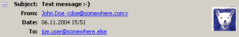
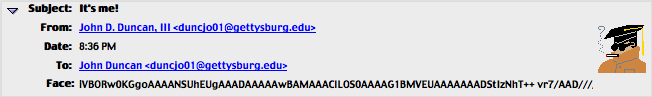
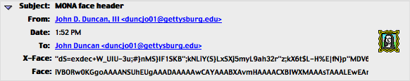
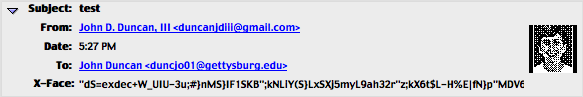
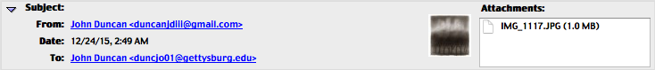
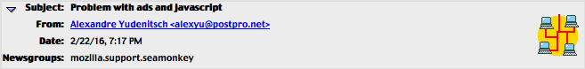
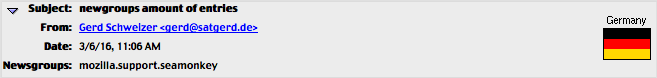
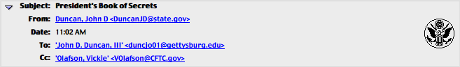

# MessageFaces
This is a mirror of http://web.archive.org/web/20100108015331/http://tecwizards.de/mozilla/messagefaces/. This program is currently ~~BROKEN~~ FIXED. Most of this readme has been copied and pasted from its original (aforementioned) location.

This extension lets Mozilla Thunderbird display 'face' images in the message header section of e-mails and newsgroup messages. These face images are intended to represent the sender, in the form of photos, cartoons, logos and so on. MessageFaces supports the following Face types:

| Type  | Description | Supported |
| ------------- | ------------- |  ------------- |
| Face  | Color PNG file embedded in the mail itself  | Display & Set |
| X-Face  | Black-and-white image embedded in the mail itself | Display only; optional |
| Gravatar | 'Globally recognized avatar' retrieved online from a central service. | Display only; optional |
| Local images | Any image in a directory of your choice. | Display only; optional |
| x-image-url | An image loaded from a web address specified in the mail (possible privacy and security risk!) | Display only; optional |
| x-face-url | Same as above ^ | Display only; optional |
| face-url | Same as above ^ | Display only; optional |
| picon | Personal Icons | Display only; optional |

picon support coming in the near future. multiple-display of face/xface/gravatar coming soon too.

# Screenshots
face (from original site)


***
normal face


***
smaller face


***
xface


***
gravatar


***
picon


***


***


***

# Faq
Q: How do I use it?

A: After installing the extension and restarting Thunderbird, open Tools -> Extensions and double click MessageFaces. On the first tab of the settings window, you can choose the Face image for each identity. On the other tabs, you can enable support for the additional face types listed above.


Q: Why can't I use files larger than 725 bytes?

A: The Face header specification dictates this to ensure your email can be properly processed by all mail servers (and you do want servers to transport your mail to the addressee, don't you?) Besides, not putting any limit on the image size needlessly bloats the message size.


Q: Why is Gravatar support optional? Should I enable it?

A: It is optional because it requires an active internet connection, and many people read their mail offline. If you do not, you should definitely enable it: Gravatars are displayed by an increasing number of weblogs next to the comment postings, so many people who don't even use Thunderbird or MessageFaces have their own Gravatar.


Q: How can I make the Face images larger, e.g. Gravatar?

A: You can change the default maximum face size of 48 Pixels by changing a hidden preference. Install the about:config extension, then open Tools -> about:config. Type `faces` into the filter field, then double click on the `extensions.messagefaces.maxsize` pref and enter a new size. Note that this setting will only enlarge Gravatar images and set the maximum size of local face images and Face URLs. Face header and X-Face images are unaffected, as their specification uses a fixed size of 48 x 48 pixels.


Q: Why is X-Face header support optional?

A: The technique used by MessageFaces to decode the image data is not very fast. While you won't notice this on modern systems (e.g. PCs with 2 GHz and more), it can seriously affect older computers. If there is enough demand, I might decide to implement a new method of decoding (using C++ code instead of JavaScript), which will be much faster. (This was written around 2007-ish. It's pretty much a non-issue at this point.. - John)
Ironically, the color Face Header is easier to process, because MessageFaces can let core Mozilla components do the main work.


Q: How can I set my own X-Face/Face URL?

A: MessageFaces does not include a user interface for these tasks. However, you can manually set these headers. Ex (in user.js):
```
// Add my beautiful mug to all of my mail and USENET profiles ;)
user_pref("mailnews.customHeaders", "X-Face: Face");
user_pref("mailnews.headers.extraExpandedHeaders", "X-Face Face");
// Add X-Face to emails
user_pref("mail.compose.other.header", "X-Face,Face");
user_pref("mail.identity.id1.headers","xface,xface2,face");
user_pref("mail.identity.id1.header.xface2", "X-Display-X-Face:<http://www.dairiki.org/xface/>");
user_pref("mail.identity.id1.header.xface", "X-Face:\"dS=exdec+W_UIU-3u;#}nMS}IF1SKB\";kNLiY(S}LxSXj5myL9ah32r\"z;kX6t$L-H%E|fN}p\"MDV6QL||@i`WRth?dQfm5(?Y^ABJz\\/UE|elUyeGz`C0dbwVNL=.9MJ9<3VZCnYU~QemCXs^/]{1Piu]oT^d=w$j4i-j(li3My^pt.wtRT@[eJYI(X3_1yn4L;C8m%DZsRzX'g_*CdxC1}:n2MRr),\"\"bfG}?rb{d9eoJ@W0gg?l)P_8q7l!(!\\5ixU%?H8U9el?Ov<X@D/:l!/bR_\"K-P"); // my drivers license
user_pref("mail.identity.id1.header.face", "Face: iVBORw0KGgoAAAANSUhEUgAAADAAAAAwCAYAAABXAvmHAAAACXBIWXMAAAsTAAALEwEAmpwY AAAAB3RJTUUH4AMHEQY2hOMIEwAAAi5JREFUaN7tWFGOxCAIxcncqxyNo+HJ3I9KByk22trubNaX TNpY0Qc80RFgYmJiYuI/IzT2Sx22yemTOu2a+TU7kMzwIezs09px18dts7YN47t4d6Ur6BkBQvhE TQjYPgdtyYy169OCd6/m9GReZIna2jyS1pFbHAjBn0iTbGnz7HvJ96yBQqdnJmrNbo/+AQBeXcEP +xmZeZ05/5g5R5TcZ9EvP8Wml3xvBrYsbI7kkHGMAACAy3KYHiICIioICxBRS/MZB4QILgtwjICI RbslqMHMq8M5AGcd6CWfACARrU9mTmtrWt+lzYF8/4xBmz0zb2PK91ZSryseSeS9CBvihcZFStr+ bhTR9zKQo1ZET2dF3olo62czcCYLr6uecYxFFLP+EzMnRFy1jrhlSKI/Cu/RqULEkJ8pky/OPNaB qxJqzUCQHdgLXk3/3lo4ygARdFei16jIe6SyhJK3F4zCcAeEsOywkh2R0mgHLu0DkKBeXVRFqlWh zT7B6X1gQBn9lE/rhCauf9JP7K+U0UsOeBkoIqwIu99NBh7fBzgy4FLWd61xe9K0a0DsOfL3rIGa jOx3K6O718DBYQ52kvEIaMc8GT3hAJgJalXo6GqmmoEnyO8cOJCPRBzMMaLuxG844MnCq0JH5CWT j8mnJQO9T52BXie6bub0PY89DfSeDjx7/b//lps5PXjlKrAgJu9em2f/2MVW7apxZNstEvrGy90/ f70+MTExMfG/8QNfeBb5Z7fnoQAAAABJRU5ErkJggg=="); //windows 3.0 mona lisa ico
```


Q: What are Face URLs?

A: Recently, the idea of putting a link to a photo of the sender into the mail has been made popular by Apple Computer's .Mac mail accounts. It works by inserting a special header named "X-Image-URL" into the message, containing the http:// address of a picture that should be displayed. MessageFaces also supports the rare headers "X-Face-URL" and "Face-URL", which serve the same purpose. Note that you should read the security/privacy warning displayed in the MessageFaces settings window before activating this feature.


Q: Are picons supported?

A:  Not yet. This feature will be available in MessageFaces 1.2. (I still plan on doing this - John)


Q: Are favatars supported?

A: No, and I will most certainly not add it. Favatars are meant to be added to weblog posts where the commenter entered the URI of his home page, which is then used to retrieve the favicon. As e-mails don't have a web page address in them, MessageFaces would have to use the sender's e-mail address instead. However, no one guarantees there is a web server behind that domain name, and even if there is, it's not very likely that the user has control over the top level directory (e.g. www.hotmail.com/). Additionally, a user's home page is often at an entirely different server than his e-mail address (perhaps because it's a hosting company, and his e-mail address is handled by his ISP). So unless people e-mail me and convince me that it's worth the effort, I'm not going to implement it - users have better options for online face images (e.g. gravatar.com).


Q: What other mail/news clients support the Face header?

A: Lars Magne Ingebrigtsen, the creator of the Face header, maintains a list of software that has Face support at http://quimby.gnus.org/circus/face/ (at the bottom of the page). The list is not very long, so it might be a good idea to convince your e-mail contacts to use Thunderbird (and MessageFaces) if they want to see your Face image ;-)


Q: Can I translate MessageFaces into another language?

A: Translations are always welcome - please contact me via the address given on the bottom of this page. I only ask for two things: first, send me your locale files, so I can incorporate them into the next release. Second, expect that I contact you asking to update your translation for new releases. 


# Creating a Face image

1. Find an appropriate image (avoid many colors and high complexity) and use your favorite graphics software to scale it to 48 x 48 pixels.
2. Save it in the portable network graphic format (PNG) in non-interlaced mode with palette-based colors. Transparency increases the file size, so be sure to disable it if you don't need it.
3. Check the file size. If it is larger than 725 pixels, try to decrease the number of colors in the image (usually, 8 to 15 colors make the file small enough). Additionally, you can try command line tools like [pngrewrite](http://entropymine.com/jason/pngrewrite/) and [pngcrush](http://pmt.sourceforge.net/pngcrush/), which often further reduce the file size.
4. Open Tools -> Extensions -> MessageFaces -> Options. Select the desired identity and press the "Set Face" button. Select the image file, and press the "OK" button. (Note: the Face is saved directly into the identity. If you plan to uninstall MessageFaces but don't want to keep the Face, you have to remove it via the MessageFaces settings window before uninstalling the extension.)


# Changelog
1.1.3 (2016-03-07)

Version 1.1.2 of this add-on was completely broken on SeaMonkey 2.39.

- Fixed an old msgHdrViewOverlay.js method call that had been removed from the API (GetFirstSelectedMessage() is now gFolderDisplay.selectedMessageUris[0];)

- Fixed a bug that would prevent the default preferences from being read

-  Fixed a bug that would assign the wrong variable preference values (changed gPrefBranch calls to global mfPref. gPrefBranch was never even initialized??)

- Fixed a bug that would cause the program to give up before reading the entire header (this was especially bad for modern web-servers like Google's gmail. (changed '(content.length > 512 * 8)' to (content.length > 512 * 32)

- Wow this was hard to debug without a working logger on SM 2.39...

- This add-on now works again.


1.1.2 (2007-05-14)

-  V1.1.2 fixes a bug introduced in version 1.1.1 which continued to show the previous message's face image when the selected message did not have one.


1.1.1 (2007-05-01)

- With version 1.1.1, MessageFaces was made compatible with Thunderbird 2. No other changes were made.


1.1 (2005-08-05)

- Adds support for X-Face headers, gravatar.com, local Face images and Face URLs. Adds Brazilian, Catalan, Hungarian and Polish locales.


1.0 (2004-10-28)

- Initial release, displays the Face header and allows the user to set Face images for each identity. Includes English (en-US) and German (de-DE) locales. Followed by bugfix releases 1.0.1 and 1.0.2

# Sources
http://www.dairiki.org/xface/

https://dev.mutt.org//trac/wiki/MuttGuide/XFace

http://web.archive.org/web/20131017163425/http://www.mythic-beasts.com/tools-toys/xface/

http://0xcc.net/unimag/11/images/xface-gallery.png

http://2prinz.de/dialog/face.htm

http://research.swtch.com/face

http://www.cs.indiana.edu/ftp/faces/

http://www.metron.com/FaceSaver/

ftp://ftp.uu.net/published/usenix/faces/

https://blogs.oracle.com/richb/entry/the_faces_project

http://ace.home.xs4all.nl/X-Faces/

http://web.archive.org/web/20080723180241/http://mailglance.com/index.html

ftp://ftp.cs.indiana.edu/pub/faces/picons/db/

http://quimby.gnus.org/circus/face/

https://developer.mozilla.org/en-US/docs/Mozilla/Thunderbird/Buddy_icons_in_mail

http://marc.info/?l=mozilla-patches&m=97310220422751

http://web.archive.org/web/20100108015331/http://tecwizards.de/mozilla/messagefaces/

http://quimby.gnus.org/circus/face/

https://developer.mozilla.org/en-US/docs/Mozilla/Thunderbird/Buddy_icons_in_mail

http://web.archive.org/web/20080723180241/http://mailglance.com/index.html

http://xsidebar.mozdev.org/modifiedmailnews.html

http://mirrors.directorymix.com/mozilla/addons/393/

https://addons.mozilla.org/En-US/thunderbird/addon/senderface/

https://addons.mozilla.org/en-US/thunderbird/addon/display-contact-photo/

https://addons.mozilla.org/en-us/seamonkey/addon/mnenhy/

http://web.archive.org/web/20131017163425/http://www.mythic-beasts.com/tools-toys/xface/

https://de.wikipedia.org/wiki/X-Face

https://en.wikipedia.org/wiki/X-Face

https://en.wikipedia.org/wiki/Vismon

http://freecode.com/projects/compface/

https://en.wikipedia.org/wiki/Netpbm

http://gigliwood.com/weblog//MacOSX/Putting_your_pictur.html

https://github.com/TheOpenSourceNinja/thunderbird-display-faces

http://web.archive.org/web/20120309141358/http://homes.esat.kuleuven.be/~texmf/cgi-bin/showinfo.pl?(mh-e)Picture&uptodir=0

http://web.archive.org/web/20071005153345/http://chatzilla.hacksrus.com/faces.pl

http://chatzilla.hacksrus.com/facesrv/

http://www.emacswiki.org/emacs/CategoryFaces

http://forums.mozillazine.org/viewtopic.php?t=173064