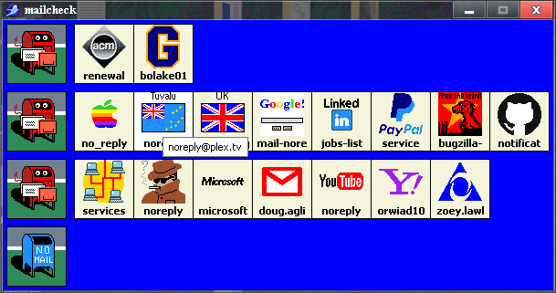
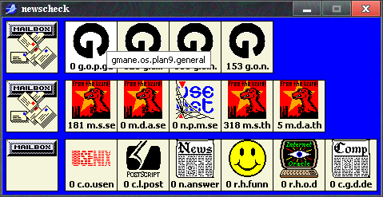
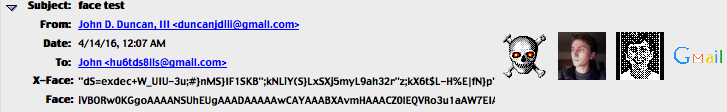
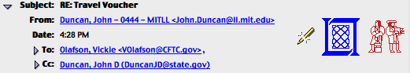
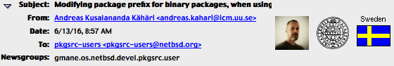
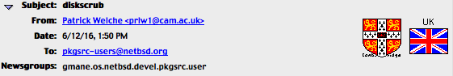
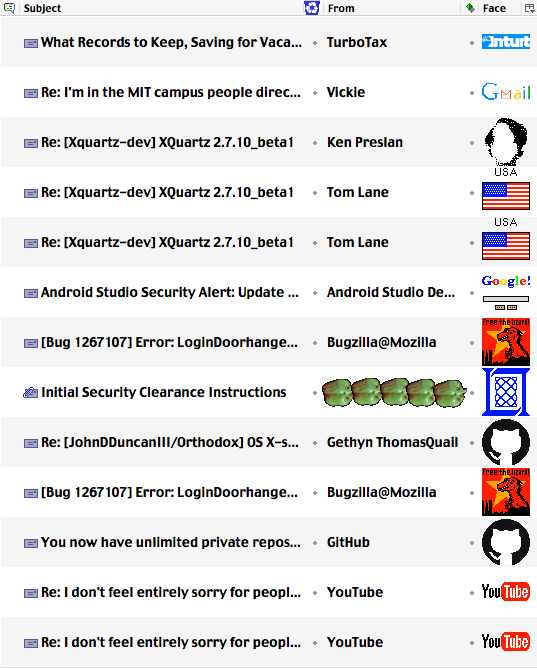
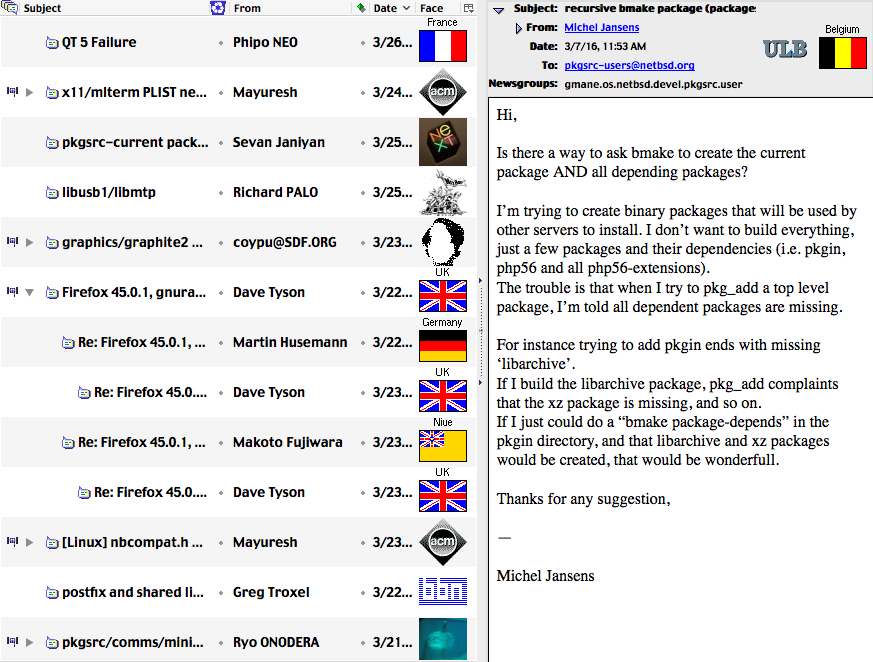
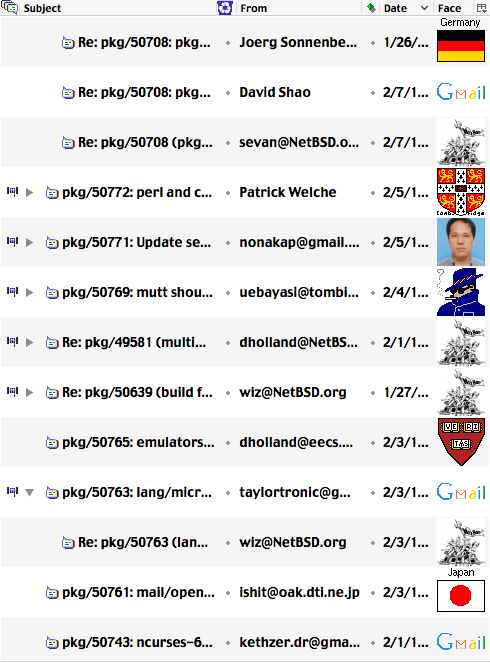

# MessageFaces
This extension lets Mozilla [SeaMonkey](https://www.seamonkey-project.org/) display 'face' images in the message header section of e-mails and newsgroup messages, in a custom mailnews column (optionally), and in `mailcheck` and `newscheck` windows which are XUL clones of the [xfaces](http://kinzler.com/picons/ftp/demo/from.gif) and [picons newscheck-faces](http://kinzler.com/picons/ftp/demo/newscheck.gif) unix [programs](http://kinzler.com/picons/ftp/demo/) (optionally).

These face images are intended to represent the sender in the form of photos, cartoons, logos, picons, and so on.

This project is a continuation of Jens Banneman's [MessageFaces](http://web.archive.org/web/20100108015331/http://tecwizards.de/mozilla/messagefaces/) and a spiritual successor to [Rob Pike and Dave Presotto's](https://research.swtch.com/face) Plan 9 program [Vismon](https://en.wikipedia.org/wiki/Vismon), Chris Liebman's [xfaces](http://kinzler.com/ftp/faces/#xfaces), Rich Burridge's [faces](http://kinzler.com/ftp/faces/#faces), [Steve Kinzler's](http://kinzler.com/picons/ftp/) [Picons](http://kinzler.com/ftp/faces/#picons), and NeXT Computer's [NeXTMail](https://en.wikipedia.org/wiki/Apple_Mail). Most of this README has been copy/pasted from its original website.

MessageFaces supports the following Face types:

| Type  | Description | Supported |
| ------------- | ------------- |  ------------- |
| Face			| Color PNG file embedded in the mail itself																							| Display & Set			 |
| X-Face		| Black-and-white image embedded in the mail itself																						| Display only; optional |
| Gravatar		| 'Globally recognized avatar' retrieved online from a central service. 																| Display only; optional |
| Local images	| Any image in a directory of your choice. 																								| Display only; optional |
| x-image-url	| An image loaded from a web address specified in the mail (possible privacy and security risk!) 										| Display only; optional |
| x-face-url	| Same as above																															| Display only; optional |
| face-url		| Same as above																															| Display only; optional |
| picon			| Personal Icons																														| Display only; optional |
| address book	| Displays the contact photo for the sender contained in the address book																| Display only; optional |
| gmail/google+	| Display the google profile image of the sender using [gcontactsync](https://addons.mozilla.org/en-US/thunderbird/addon/gcontactsync/) | Display only; optional |

# Changelog
1.3.2 (2021-2-15)
- Fix https://github.com/JohnDDuncanIII/messagefaces/issues/6
- Fix a couple of bugs which would cause `chrome://messenger/content/messenger.xul` to raise an error when it was opened in [DOM Inspector](https://addons.thunderbird.net/en-us/seamonkey/addon/dom-inspector-6622/) with MessageFaces enabled.
- Update `headerOverlay.js` event listeners to ensure that we only initialize the global XPCOM helpers once and only run `mfDisplayFace` once per message.
- Disable anchor URIs in `mailcheck` and `newscheck` due to the broken `nsIMsgFolder` `getUriForMsg` URIs in SeaMonkey 2.53.6.
- Update README

1.3.1 (2020-12-14)
- Fix https://github.com/JohnDDuncanIII/messagefaces/issues/4
- Fix `mailcheck.js` breakage which occurred due to http://mozilla.6506.n7.nabble.com/Upcoming-change-to-fixIterator-function-in-iteratorUtils-jsm-td367711.html
- Begin codebase cleanup

1.3.0 (2017-10-20)
- add support for monitoring windows (similar to picons newscheck-faces and xfaces unix programs)
- allow multi-picon support for web lookups
- style treerows in mailnews

1.2.5 (2016-04-25)
- implement a dirty hack that will only apply the column to the mailnews view when the preference is enabled

1.2.4 (2016-04-24)
- add custom mailnews column; cache gravatar images; enable x-face styling through #fromBuddyIconXFace element (for example, in the userChrome.css file).

1.2.3 (2016-04-09)
- Added support for address book/contact photo faces in the message header.

1.2.2 (2016-04-01)
- Added support for displaying multiple picons at once (for local lookups), if available.

- Can now display X-Image-URL, X-Face-URL, and Face-URL headers in separate vboxes (alongside all other headers).

1.2.1 (2016-03-04)
- Added local picon lookup support.

1.2 (2016-03-08)
- Added picon support.

1.1.3 (2016-03-07)

Version 1.1.2 of this add-on was completely broken on SeaMonkey 2.39.

- Fixed an old msgHdrViewOverlay.js method call that had been removed from the Mozilla API (GetFirstSelectedMessage() is now gFolderDisplay.selectedMessageUris[0];)

- Fixed a bug that would prevent the default preferences from being read

- Fixed a bug that would assign the wrong variable preference values (changed deprecated gPrefBranch calls to global mfPref).

- Fixed a bug that would cause the program to give up before reading the entire header (this was especially bad for modern web-servers like Google's gmail. (changed '(content.length > 512 * 8)' to (content.length > 512 * 32).

- This add-on now works again.

1.1.2 (2007-05-14)

-  V1.1.2 fixes a bug introduced in version 1.1.1 which continued to show the previous message's face image when the selected message did not have one.

1.1.1 (2007-05-01)

- With version 1.1.1, MessageFaces was made compatible with Thunderbird 2. No other changes were made.

1.1 (2005-08-05)

- Adds support for X-Face headers, gravatar.com, local Face images and Face URLs. Adds Brazilian, Catalan, Hungarian and Polish locales.

1.0 (2004-10-28)

- Initial release, displays the Face header and allows the user to set Face images for each identity. Includes English (en-US) and German (de-DE) locales. Followed by bugfix releases 1.0.1 and 1.0.2

# Screenshots
face (from original site)


***


***


***

Face, Gravatar, X-Face, Picon


***

multi-picon support


***

University, country, domain, etc. support from Steve Kinzler's [Picon Archive](http://kinzler.com/picons/ftp/)






***

Custom MessageFaces column mode supports all face types (Face, X-Face, Gravatar, Picon, URLs) - picons must be read from local db (profile/MessageFaces/picons/) and gravatars must be read from profie/MessageFaces/; internet lookup is not supported in this mode out of courtesy to the respective server operators ([Steve Kinzler](http://kinzler.com/) and [gravatar](https://gravatar.com)).






# Faq
Q: How do I use it?

A: After installing the extension and restarting SeaMonkey, open Tools -> Add-ons Manager and double click MessageFaces. On the first tab of the settings window, you can choose the Face image for each mailnews identity. On the other tabs, you can enable support for the additional face types listed above.


Q: Why can't I use PNGs larger than 725 bytes for my Face image?

A: The Face header specification dictates this hard limit to ensure that your email can be properly processed by all mail servers (and you do want servers to transport your mail to the addressee, don't you?). Besides, not putting any limit on the image size needlessly bloats the message size.


Q: Why is Gravatar support optional? Should I enable it?

A: It is optional because it requires an active internet connection, and many people read their mail offline. If you do not, you should probably enable it; Gravatars are displayed by an increasing number of weblogs next to the comments, so many people who don't even use SeaMonkey nor MessageFaces have their own Gravatar.


Q: How can I make the Face images larger, e.g. Gravatar?

A: You can change the default maximum face size of 48 Pixels by changing a hidden preference. Navigate to about:config, type `faces` into the filter field, then double click on the `extensions.messagefaces.maxsize` pref and enter a new size. Note that this setting will only enlarge Gravatar images and set the maximum size of local face images and Face URLs. Face header and X-Face images are unaffected, as their specification uses a fixed size of 48 x 48 pixels.


Q: Why is X-Face header support optional?

A: The technique used by MessageFaces to decode the image data is not very fast. While you won't notice this on modern systems (e.g. PCs with 2 GHz and more), it can seriously affect older computers. If there is enough demand, I might decide to implement a new method of decoding (using C++ code instead of JavaScript), which will be much faster. Ironically, the color Face Header is easier to process, because MessageFaces can let core Mozilla components do the main work.

Edit: This was written by Jens Banneman some time between 2004-2007. While it's mostly a non-issue at this point, I did re-write the x-face decoder in [go](https://github.com/JohnDDuncanIII/faces). This extension still uses the original javascript decoder because I don't know how to call go binaries through XPCOM.


Q: How can I set my own X-Face/Face URL?

A: MessageFaces does not include a user interface for this. However, you can manually set these headers in your profile/user.js, for example. Please note that you will need to escape each `"` character using `\`:
```
// Add X-Face image to my mail and USENET profiles ;)
user_pref("mailnews.customHeaders", "X-Face: Face");
user_pref("mailnews.headers.extraExpandedHeaders", "X-Face Face");
// Add X-Face to emails
user_pref("mail.compose.other.header", "X-Face,Face");
user_pref("mail.identity.id1.headers","xface,xface2,face");
user_pref("mail.identity.id1.header.xface2", "X-Display-X-Face:<http://www.dairiki.org/xface/>");
user_pref("mail.identity.id1.header.xface", "X-Face:\"dS=exdec+W_UIU-3u;#}nMS}IF1SKB\";kNLiY(S}LxSXj5myL9ah32r\"z;kX6t$L-H%E|fN}p\"MDV6QL||@i`WRth?dQfm5(?Y^ABJz\\/UE|elUyeGz`C0dbwVNL=.9MJ9<3VZCnYU~QemCXs^/]{1Piu]oT^d=w$j4i-j(li3My^pt.wtRT@[eJYI(X3_1yn4L;C8m%DZsRzX'g_*CdxC1}:n2MRr),\"\"bfG}?rb{d9eoJ@W0gg?l)P_8q7l!(!\\5ixU%?H8U9el?Ov<X@D/:l!/bR_\"K-P"); // my drivers license
user_pref("mail.identity.id1.header.face", "Face: iVBORw0KGgoAAAANSUhEUgAAADAAAAAwCAYAAABXAvmHAAAACXBIWXMAAAsTAAALEwEAmpwY AAAAB3RJTUUH4AMHEQY2hOMIEwAAAi5JREFUaN7tWFGOxCAIxcncqxyNo+HJ3I9KByk22trubNaX TNpY0Qc80RFgYmJiYuI/IzT2Sx22yemTOu2a+TU7kMzwIezs09px18dts7YN47t4d6Ur6BkBQvhE TQjYPgdtyYy169OCd6/m9GReZIna2jyS1pFbHAjBn0iTbGnz7HvJ96yBQqdnJmrNbo/+AQBeXcEP +xmZeZ05/5g5R5TcZ9EvP8Wml3xvBrYsbI7kkHGMAACAy3KYHiICIioICxBRS/MZB4QILgtwjICI RbslqMHMq8M5AGcd6CWfACARrU9mTmtrWt+lzYF8/4xBmz0zb2PK91ZSryseSeS9CBvihcZFStr+ bhTR9zKQo1ZET2dF3olo62czcCYLr6uecYxFFLP+EzMnRFy1jrhlSKI/Cu/RqULEkJ8pky/OPNaB qxJqzUCQHdgLXk3/3lo4ygARdFei16jIe6SyhJK3F4zCcAeEsOywkh2R0mgHLu0DkKBeXVRFqlWh zT7B6X1gQBn9lE/rhCauf9JP7K+U0UsOeBkoIqwIu99NBh7fBzgy4FLWd61xe9K0a0DsOfL3rIGa jOx3K6O718DBYQ52kvEIaMc8GT3hAJgJalXo6GqmmoEnyO8cOJCPRBzMMaLuxG844MnCq0JH5CWT j8mnJQO9T52BXie6bub0PY89DfSeDjx7/b//lps5PXjlKrAgJu9em2f/2MVW7apxZNstEvrGy90/ f70+MTExMfG/8QNfeBb5Z7fnoQAAAABJRU5ErkJggg=="); //windows 3.0 mona lisa ico
```


Q: What are Face URLs?

A: Recently, the idea of putting a link to a photo of the sender into the mail has been made popular by Apple Computer's [.Mac mail](https://en.wikipedia.org/wiki/Apple_Mail) accounts. It works by inserting a special header named ["X-Image-URL"](https://en.wikipedia.org/wiki/X-Face) into the email header, containing the http:// address of a picture that should be displayed. MessageFaces also supports the rare headers "X-Face-URL" and "Face-URL", which serve the same purpose. Please read the security/privacy warning displayed in the MessageFaces settings window before activating this feature as it is a privacy/security risk and could be used to track you.


Q: Are picons supported?

A: Yes! This feature was added by John in MessageFaces 1.2. Local picons databases can be downloaded from Steve Kinzler's picon [database](http://kinzler.com/ftp/faces/picons/db/), untar'd, and placed in profile/MessageFaces/picons/ to enable multi-picon and custom column picon support.


Q: Are favatars supported?

A: No. Favatars are meant to be added to weblog posts where the commenter entered the URI of his home page, which is then used to retrieve the favicon. As e-mails don't have a web page address in them, MessageFaces would have to use the sender's e-mail address instead. However, no one guarantees there is a web server behind that domain name, and even if there is, it's not very likely that the user has control over the top level directory (e.g. www.hotmail.com/). Additionally, a user's home page is often at an entirely different server than his e-mail address (perhaps because it's a hosting company, and his e-mail address is handled by his ISP). So unless people e-mail me and convince me that it's worth the effort, I'm not going to implement it - users have better options for online face images (e.g. gravatar.com).


Q: What other mail/news clients support the Face header?

A: Lars Magne Ingebrigtsen, the creator of the Face header, maintains a list of software that has Face support at http://quimby.gnus.org/circus/face/ (at the bottom of the page). The list is not very long, so it might be a good idea to convince your e-mail contacts to use SeaMonkey (and MessageFaces) if they want to see your Face image ;-)


Q: Can I translate MessageFaces into another language?

A: Translations are always welcome - please contact me via [email](mailto:duncanjdiii@gmail.com). I only ask for two things:

1) First, send me your locale files so I can incorporate them into the next release. 
2) Second, please expect me to potentially contact you asking for an updated translation for new releases.


# Creating a Face image

1. Find an appropriate image (avoid many colors and high complexity) and use your favorite graphics software to scale it to 48 x 48 pixels.
2. Save it in the portable network graphic format (PNG) in non-interlaced mode with palette-based colors. Transparency increases the file size, so be sure to disable it if you don't need it.
3. Check the file size. If it is larger than 725 pixels, try to decrease the number of colors in the image (usually, 8 to 15 colors makes the file small enough). Additionally, you can try command line tools like [pngrewrite](http://entropymine.com/jason/pngrewrite/) and [pngcrush](http://pmt.sourceforge.net/pngcrush/), which often further reduce the file size.
4. Open Tools -> Add-ons Manager -> MessageFaces -> Options. Select the desired identity and press the "Set Face" button. Select the image file, and press the "OK" button. (Note: the Face is saved directly into the identity. If you plan to uninstall MessageFaces but don't want to keep the Face, you have to remove it via the MessageFaces settings window before uninstalling the extension.)

# How do I set the contact photo image?

Just click on the sender's contact card in your address book, then pick a local or remote (web) image. The image will then be copied into your profile directory's "Images" folder (NOT profile/MessageFaces/images/; this is handled by the client itself, not the extension)

# Sources
https://kinzler.com/picons/ftp/

http://kinzler.com/ftp/faces/

http://www.cs.indiana.edu/ftp/faces/

http://kinzler.com/ftp/faces/picons/db/

ftp://ftp.cs.indiana.edu/pub/faces/picons/db/

http://faces.sourceforge.net/

http://users.cecs.anu.edu.au/~jaa/

https://web.archive.org/web/20160410105416/http://users.cecs.anu.edu.au:80/~jaa/

http://www.dairiki.org/xface/

https://dev.mutt.org//trac/wiki/MuttGuide/XFace

http://web.archive.org/web/20131017163425/http://www.mythic-beasts.com/tools-toys/xface/

http://0xcc.net/unimag/11/images/xface-gallery.png

http://2prinz.de/dialog/face.htm

http://research.swtch.com/face

http://www.metron.com/FaceSaver/

ftp://ftp.uu.net/published/usenix/faces/

https://blogs.oracle.com/richb/entry/the_faces_project

http://ace.home.xs4all.nl/X-Faces/

http://www.toad.com/facesaver/

http://quimby.gnus.org/circus/face/

https://developer.mozilla.org/en-US/docs/Mozilla/Thunderbird/Buddy_icons_in_mail

http://marc.info/?l=mozilla-patches&m=97310220422751

http://web.archive.org/web/20100108015331/http://tecwizards.de/mozilla/messagefaces/

https://web.archive.org/web/20101206025832/http://www.xs4all.nl:80/~walterln/winface/

http://gigliwood.com/weblog/MacOSX/Putting_your_pictur.html

https://web.archive.org/web/20131017163425/http://www.mythic-beasts.com/tools-toys/xface/

https://developer.mozilla.org/en-US/docs/Mozilla/Thunderbird/Buddy_icons_in_mail

http://web.archive.org/web/20080723180241/http://mailglance.com/index.html

http://xsidebar.mozdev.org/modifiedmailnews.html

http://mirrors.directorymix.com/mozilla/addons/393/

https://addons.mozilla.org/En-US/thunderbird/addon/senderface/

https://addons.mozilla.org/en-US/thunderbird/addon/display-contact-photo/

https://addons.mozilla.org/en-us/seamonkey/addon/mnenhy/

http://web.archive.org/web/20131017163425/http://www.mythic-beasts.com/tools-toys/xface/

https://de.wikipedia.org/wiki/X-Face

https://en.wikipedia.org/wiki/X-Face

https://en.wikipedia.org/wiki/Vismon

http://freecode.com/projects/compface/

https://en.wikipedia.org/wiki/Netpbm

http://gigliwood.com/weblog//MacOSX/Putting_your_pictur.html

https://github.com/TheOpenSourceNinja/thunderbird-display-faces

http://web.archive.org/web/20120309141358/http://homes.esat.kuleuven.be/~texmf/cgi-bin/showinfo.pl?(mh-e)Picture&uptodir=0

http://web.archive.org/web/20071005153345/http://chatzilla.hacksrus.com/faces.pl

http://chatzilla.hacksrus.com/facesrv/

https://gitlab.com/muttmua/mutt/-/wikis/MuttGuide/XFace

http://m-einfalt.de/xface_index.php

http://gnuwin32.sourceforge.net/packages/compface.htm

http://freshmeat.sourceforge.net/projects/compface/

https://www.metron.com/FaceSaver/

http://www.emacswiki.org/emacs/CategoryFaces

http://forums.mozillazine.org/viewtopic.php?t=173064

https://bugzilla.mozilla.org/show_bug.cgi?id=20417

https://bugzilla.mozilla.org/show_bug.cgi?id=60881

https://bugzilla.mozilla.org/show_bug.cgi?id=61520

https://bugzilla.mozilla.org/show_bug.cgi?id=83364

https://bugzilla.mozilla.org/show_bug.cgi?id=168236

https://bugzilla.mozilla.org/show_bug.cgi?id=195559

https://bugzilla.mozilla.org/show_bug.cgi?id=331924

https://bugzilla.mozilla.org/show_bug.cgi?id=402759

https://bugzilla.mozilla.org/show_bug.cgi?id=453627

http://groups.csail.mit.edu/up/projects/facemail/ericl-thesis.pdf

https://cups.cs.cmu.edu/soups/2007/proceedings/p122_lieberman.pdf

https://gitlab.com/CardBook/CardBook

https://addons.thunderbird.net/en-US/thunderbird/addon/cardbook/
